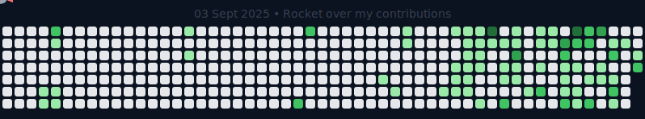

# Hey, I'm Shravan 👋

🚀 20 y/o Software Engineer | Full-stack Web Dev  
💻 I build apps with **Next.js, Node.js, TypeScript, JavaScript**  
🌍 Dreaming big & working towards remote dev opportunities

---

## ⚡ Tech Stack

---

## 🚀 Featured Projects

- 🎮 **[Bliss](#)** – A gamified social platform to enhance social & creative skills
- 🧠 **[Recru.it](#)** – AI-powered recruitment & career management platform
- 🎥 **[StreamIt](#)** – A YouTube-like full-stack video platform (in progress)
- ✍️ **[UpBlog](#)** – SaaS platform for creators & businesses to publish blogs

_(more cool stuff on the way…)_

---

## 📊 GitHub Stats

  
  

---

## ✨ Interactive Rocket over my Contributions

> 🚀 **NEW**: Interactive rocket that follows your cursor! Move your mouse to control the flight path.

  

**🎮 Features:**

- 🖱️ **Cursor Control**: Rocket follows your mouse movement
- 📊 **Real Data**: Based on actual GitHub contribution patterns
- ✨ **Interactive**: Hover over contribution squares for details
- 🌟 **Immersive**: Space theme with nebulae and twinkling stars

> 💡 Want the full interactive experience? Check out `ROCKET_README.md` for the complete HTML version!

---

## 😂 Random Dev Meme of the Day

<!-- meme:end -->

---

## 🎯 Current Focus

- Mastering **Next.js + Node.js** with scalable projects
- Exploring **AI + agentic systems**
- Building SaaS products that actually solve problems

---

## 🌐 Connect with Me

  

